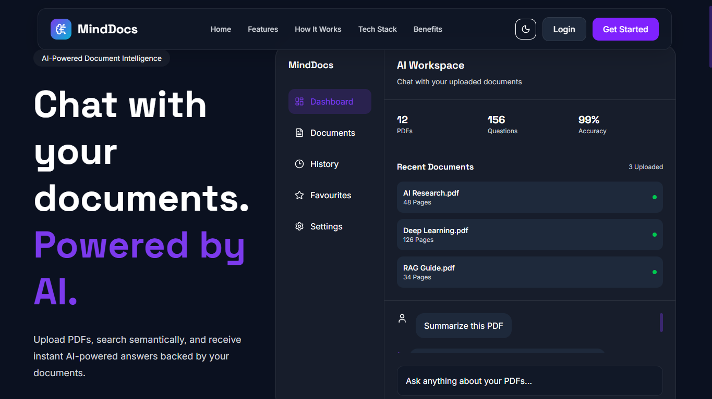
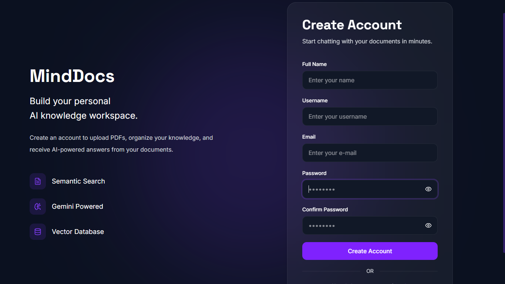
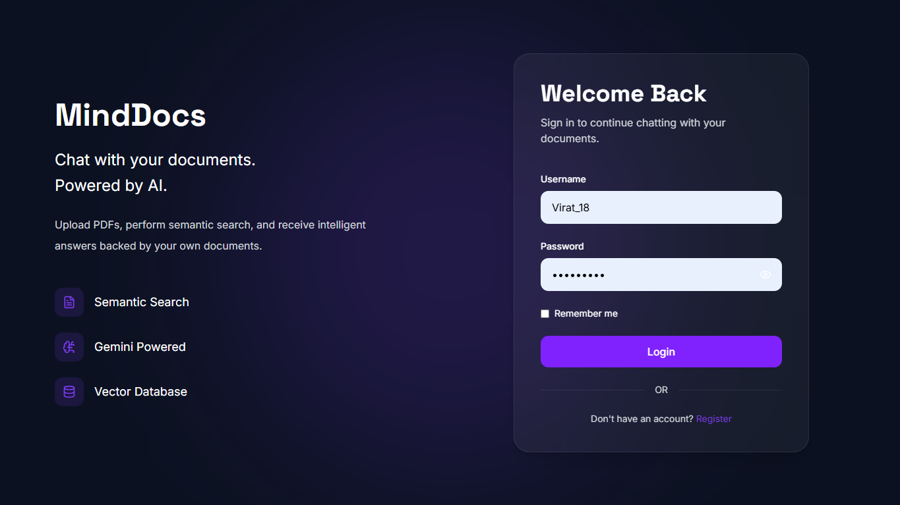
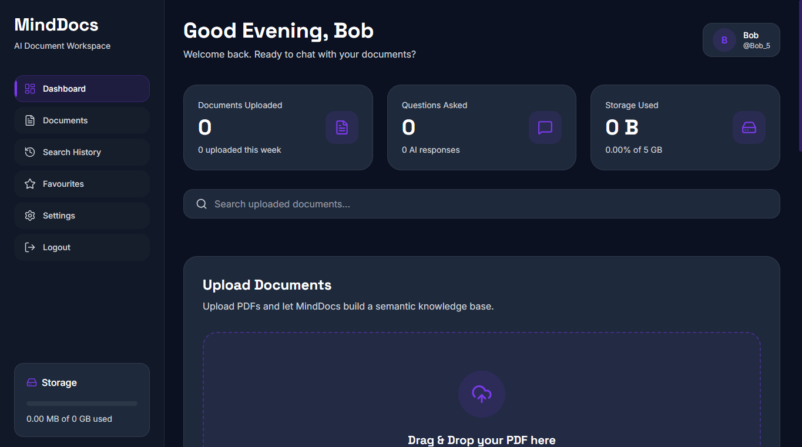
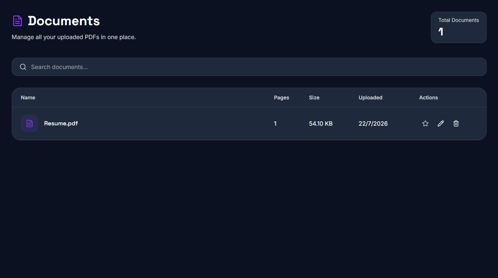
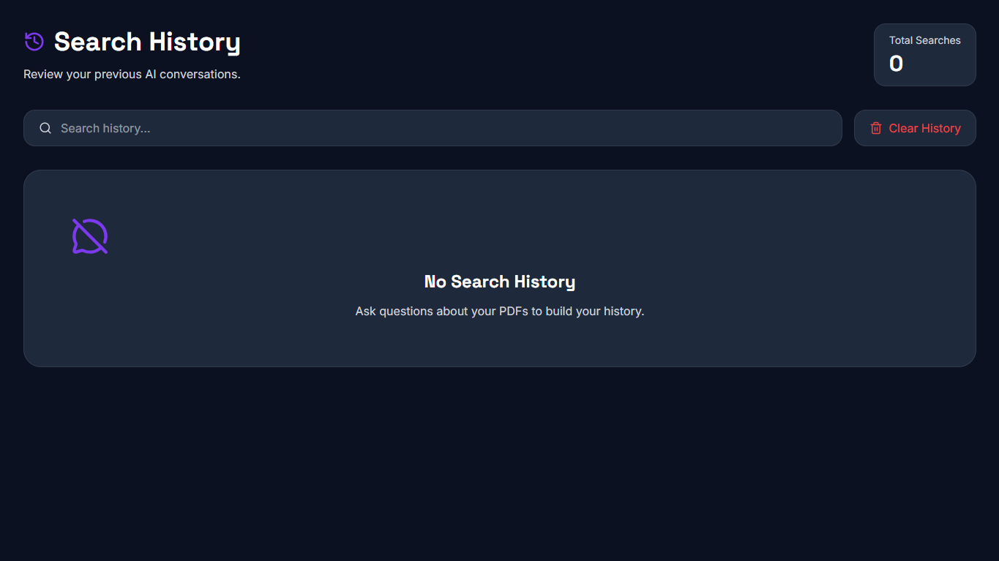
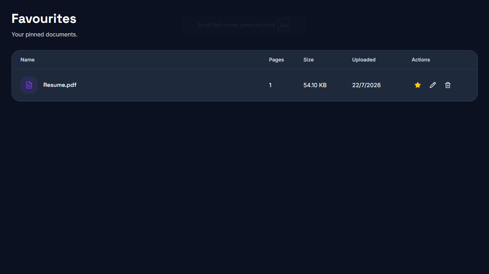
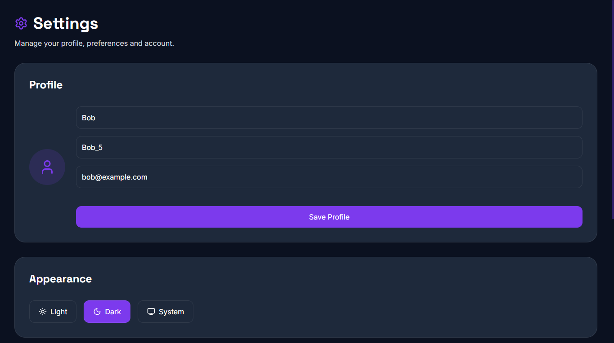
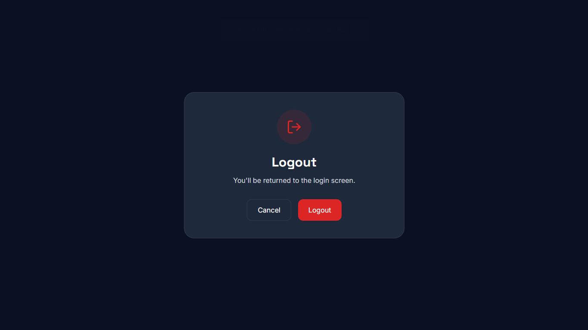

# MindDocs — Chat With Your Documents Using AI

<p align="center">
  <b>AI-powered document intelligence platform that lets you upload PDFs, ask questions, and get context-aware answers from your own documents.</b>
</p>

<p align="center">
  Built using modern AI technologies including Retrieval Augmented Generation (RAG), Large Language Models, semantic search, and vector databases.
</p>


---

## Overview

MindDocs is an AI-powered document assistant that allows users to interact with their PDF documents through natural conversations.

Instead of manually searching through hundreds of pages, users can upload documents and ask questions in plain language. MindDocs retrieves relevant information from the documents and generates accurate, context-aware responses.

The project implements a **Retrieval Augmented Generation (RAG)** pipeline:

```
PDF Upload
     |
     ↓
Text Extraction
     |
     ↓
Text Chunking
     |
     ↓
Embedding Generation
     |
     ↓
Vector Storage (FAISS)
     |
     ↓
Semantic Retrieval
     |
     ↓
LLM Response Generation
```

---

# Features

## Document Management

- Upload PDF documents
- Automatic text extraction
- Document metadata tracking
- Document search
- Rename documents
- Delete documents
- Pin favourite documents
- View document storage information


---

## AI Document Chat

- Ask questions about uploaded documents
- Context-aware AI responses
- Semantic document retrieval
- Conversation history
- Resume previous conversations
- Source-grounded answers


---

## Authentication

- User registration
- Secure login system
- JWT authentication
- Protected routes
- Remember me functionality
- Automatic token handling
- Logout support


---

## Search History

- Save previous conversations
- Search previous chats
- Group history by time
- Reopen previous conversations
- Delete individual sessions
- Clear complete history


---

## Settings

- Update profile information
- Dark/light/system theme support
- Export user data
- Clear chat history
- Clear documents
- Account management


---

## Modern UI Experience

- Premium SaaS-style interface
- Dark and light themes
- Glassmorphism design
- Responsive layouts
- Smooth animations
- Toast notifications
- Modern typography


---

# System Architecture


```
                 User
                  |
                  |
             React Frontend
                  |
                  |
              FastAPI API
                  |
        ---------------------
        |                   |
 Authentication        Document System
        |                   |
       JWT              PDF Processing
                            |
                            |
                    Text Extraction
                            |
                            |
                    Text Chunking
                            |
                            |
                   Gemini Embeddings
                            |
                            |
                         FAISS
                            |
                            |
                    Semantic Search
                            |
                            |
                    Gemini LLM
                            |
                            |
                    Final Answer
```


---

# Tech Stack


## Frontend

| Technology | Purpose |
|---|---|
| React | User Interface |
| Vite | Frontend tooling |
| Tailwind CSS | Styling |
| React Router | Navigation |
| Context API | Global state management |
| Axios | API communication |
| React Query | Data handling |
| Framer Motion | Animations |
| Lucide React | Icons |
| React Hot Toast | Notifications |


---

## Backend

| Technology | Purpose |
|---|---|
| FastAPI | Backend API |
| Python | Core backend language |
| JWT | Authentication |
| Pydantic | Data validation |
| Uvicorn | Server |
| LangChain | RAG pipeline |
| Google Gemini | LLM + embeddings |
| FAISS | Vector database |
| PyPDF | PDF processing |


---

# Project Structure


```
MindDocs/

│
├── frontend/
│
│   ├── src/
│   │
│   ├── components/
│   │
│   ├── context/
│   │   ├── AuthContext
│   │   ├── ChatContext
│   │   ├── DocumentContext
│   │   └── ThemeContext
│   │
│   ├── layouts/
│   │   ├── PublicLayout
│   │   ├── AuthLayout
│   │   └── DashboardLayout
│   │
│   ├── pages/
│   │   ├── Landing
│   │   ├── Login
│   │   ├── Register
│   │   ├── Dashboard
│   │   ├── Documents
│   │   ├── SearchHistory
│   │   ├── Favourites
│   │   └── Settings
│   │
│   ├── routes/
│   │
│   ├── services/
│   │
│   └── utils/
│
│
├── backend/
│
│   ├── app/
│   │
│   ├── auth/
│   ├── documents/
│   ├── chat/
│   ├── embeddings/
│   ├── database/
│   └── main.py
│
│
└── README.md
```


---

# Getting Started


## Clone Repository


```bash
git clone https://github.com/muktig2703-dot/MindDocs

cd minddocs
```


---

# Backend Setup


Navigate to backend:

```bash
cd backend
```


Create virtual environment:


```bash
python -m venv venv
```


Activate environment:


Windows:

```bash
venv\Scripts\activate
```


Linux/Mac:

```bash
source venv/bin/activate
```


Install dependencies:


```bash
pip install -r requirements.txt
```


Create `.env` file:


```env
DATABASE_URL=your_database_url

SECRET_KEY=your_secret_key

GOOGLE_API_KEY=your_gemini_api_key
```


Run backend:


```bash
uvicorn main:app --reload
```


Backend runs at:


```
http://127.0.0.1:8000
```


API Documentation:

```
http://127.0.0.1:8000/docs
```


---

# Frontend Setup


Navigate to frontend:


```bash
cd frontend
```


Install dependencies:


```bash
npm install
```


Create `.env`:


```env
VITE_API_BASE_URL=http://127.0.0.1:8000
```


Start development server:


```bash
npm run dev
```


Frontend runs at:


```
http://localhost:5173
```


---

# Authentication Flow


```
Register
   |
   ↓
Login
   |
   ↓
Receive JWT Token
   |
   ↓
Store Token
   |
   ↓
Authenticated Requests
   |
   ↓
Protected Dashboard Access
```


Axios interceptors automatically:

- Attach JWT token
- Handle expired sessions
- Redirect unauthorized users


---

# API Endpoints


## Authentication

| Method | Endpoint | Description |
|-|-|-|
| POST | `/auth/register` | Create account |
| POST | `/auth/login` | Login user |
| GET | `/auth/me` | Current user |


---

## Documents


| Method | Endpoint | Description |
|-|-|-|
| POST | `/documents/upload` | Upload PDF |
| GET | `/documents` | Get documents |
| DELETE | `/documents/{id}` | Delete document |
| PATCH | `/documents/{id}` | Rename document |
| PATCH | `/documents/{id}/pin` | Pin document |


---

## Chat


| Method | Endpoint | Description |
|-|-|-|
| POST | `/chat` | Ask document questions |


---

# Screenshots
## Landing Page


## Register Page


## Login Page


## Dashboard Page


## Document Page


## Search History


## Favourites Page


## Settings Page


## Logout Page



---

# Future Improvements


- Real-time streaming AI responses
- Document citation highlighting
- Multiple file format support
- Cloud document storage
- Team workspaces
- Document sharing
- Docker deployment
- Production cloud deployment
- Advanced user permissions


---

# Learning Outcomes


Through this project, the following concepts were implemented:


- Retrieval Augmented Generation (RAG)
- Vector databases
- Semantic search
- LLM integration
- API architecture
- JWT authentication
- React state management
- Modern frontend design
- AI application development


---

# Author


**Mukti Gupta**

AI & Machine Learning Student

GitHub:
https://github.com/muktig2703-dot


---